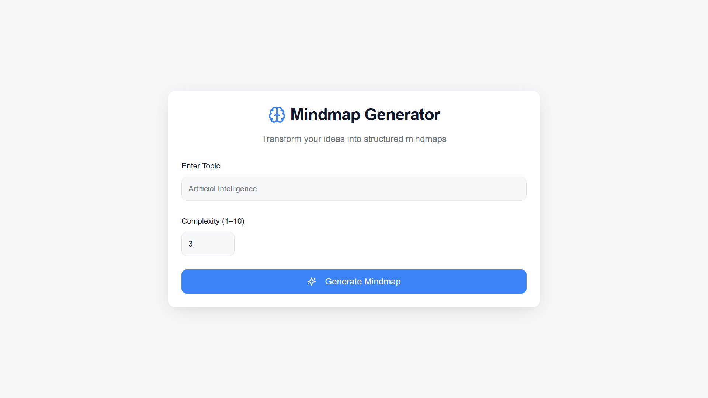
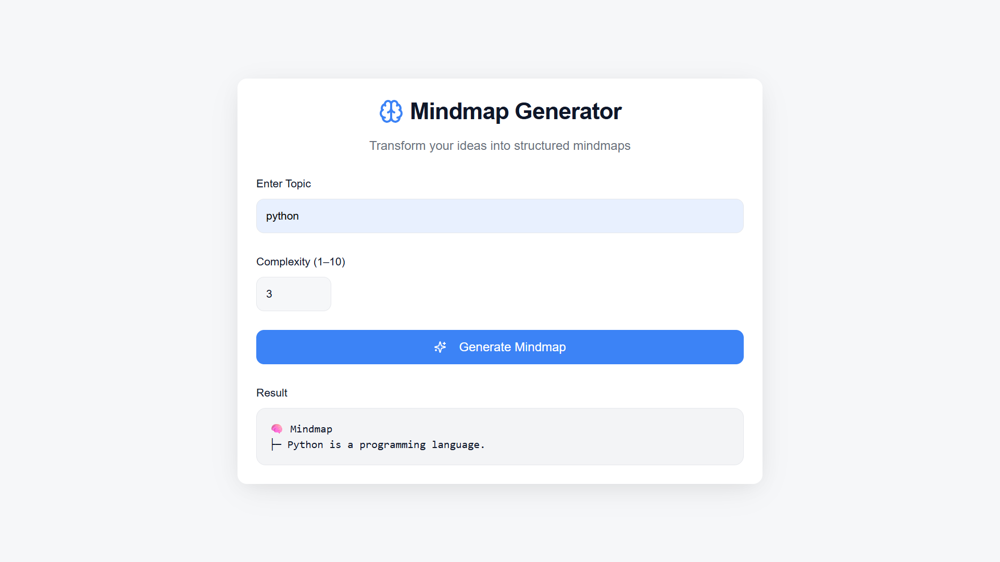
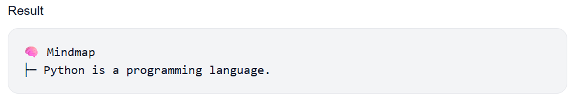

#  Mind Map Generator (Topic Tree Creator)

 **The Mind Map Generator** is an AI-powered web application that converts unstructured textual content into a clear, hierarchical mind map. By using advanced Natural Language Processing (NLP) techniques with a transformer-based language model, the system identifies key ideas and organizes them into a tree-structured format. Users can control the depth of information through a configurable complexity level, making the tool suitable for both quick overviews and detailed concept exploration.
The backend of the application is developed using FastAPI, ensuring high performance and easy integration through RESTful APIs, while handling long inputs with intelligent summarization when required. The frontend is built and deployed using Lovable, providing a simple and user-friendly interface for real-time interaction. This project demonstrates the practical application of AI in education and productivity by simplifying complex information and improving knowledge understanding.

---

##  Features

-  Convert text into structured mind maps
-  Adjustable complexity level
-  Clean, readable tree-style output
-  AI-powered using transformer models
-  Simple and user-friendly interface

---

##  Tech Stack

### Backend
- **FastAPI**
- **Python**
- **Hugging Face Transformers**
- **FLAN-T5 Language Model**
- **Uvicorn**

### Frontend
- **Lovable**

### Deployment
- **Google Colab** (Backend execution)
- **Ngrok** (Public API exposure)

---

##  Live Demo

🔗 **Frontend (Lovable App):**  
https://topic-tree-creator.lovable.app

---

## 🖼️ Screenshots

### Home Page

### Generated Mind Map

