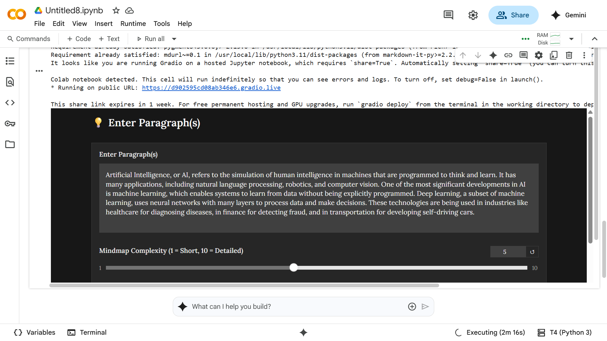
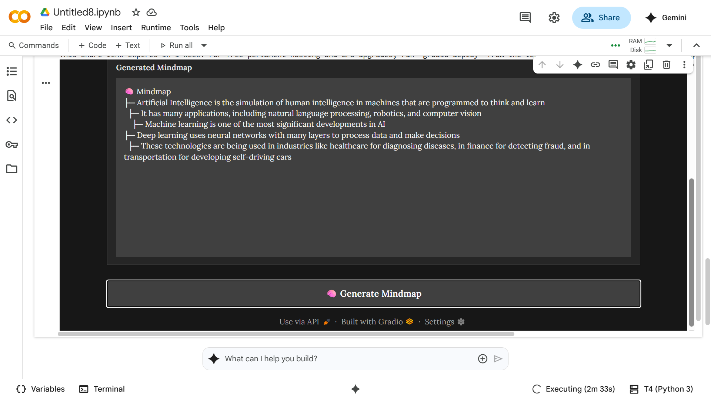

# 🧠 Mindmap Generator using FLAN-T5 & Transformers

This project proposes an automated system that generates structured mindmaps from unstructured textual input using a foundation language model. Specifically, the model leverages **FLAN-T5** (Fine-tuned LAnguage Net, Text-to-Text Transfer Transformer), a large-scale instruction-tuned transformer, to extract and organize hierarchical knowledge representations from raw paragraphs.

The system is deployed through a lightweight web-based UI built with **Gradio** and executed within a **Google Colab** environment. The backend pipeline performs three core tasks:

1. **Text Preprocessing and Optional Summarization**  
   Long or multi-paragraph inputs are optionally summarized using FLAN-T5 to ensure clarity and reduce redundancy.

2. **Information Extraction and Structuring**  
   The summarized or raw text is passed through a fine-tuned prompting structure to elicit concise topic branches and subtopics from the model, representing them in a tree-style hierarchy.

3. **Visualization and User Interaction**  
   A Gradio UI enables dynamic interaction, allowing users to input free-form text and control mindmap complexity via a slider. The system outputs a human-readable, indented tree structure that simulates mindmap topology.

Unlike traditional mindmapping tools that rely on manual input or keyword extraction, this solution utilizes generative language modeling, making it adaptive, scalable, and fully automated. The system does not rely on any external APIs, ensuring offline compatibility and model reproducibility using the `transformers` library.

---

## 🚀 Features

- ✅ Input any academic or conceptual paragraph
- ✅ Generate indented, tree-style mindmaps
- ✅ Control output depth with a complexity slider
- ✅ Optional summarization for long texts
- ✅ Fully local with no external API calls

---

## 🔍 Input Example

---

## 🌳 Output Mindmap Example

---

## 🧪 Run in Google Colab

Click to open the interactive notebook in Google Colab:

---

## 🛠️ Tech Stack

- Python 3.10
- HuggingFace Transformers
- FLAN-T5 (Google)
- Gradio
- Google Colab

---
